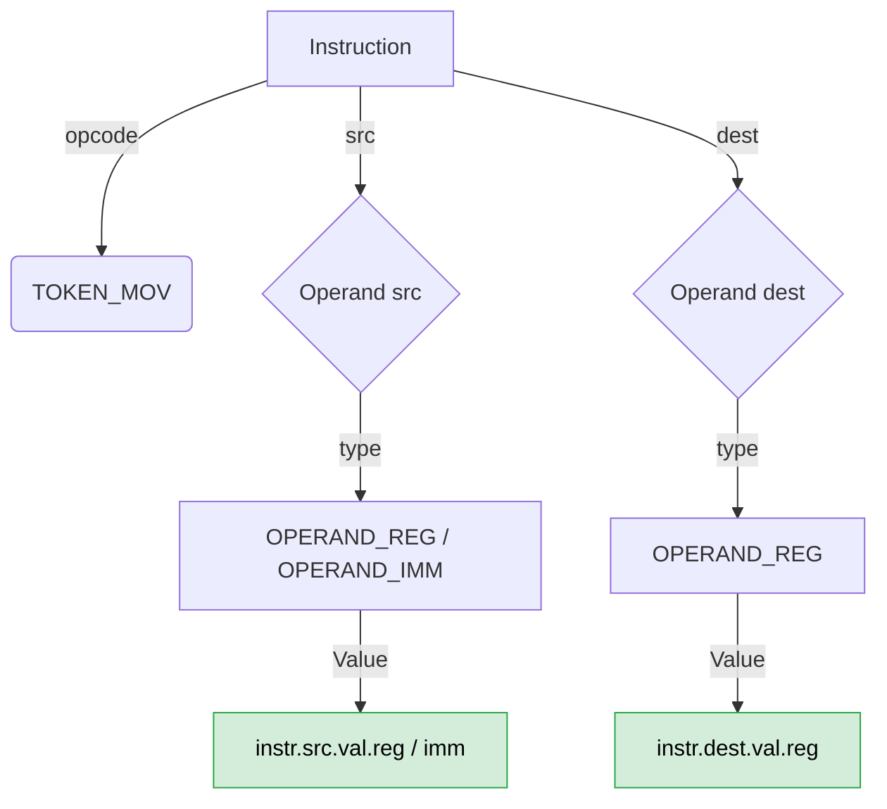
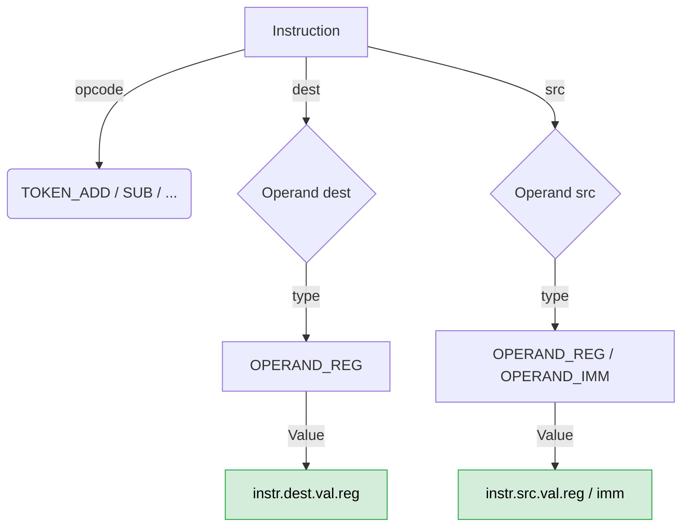
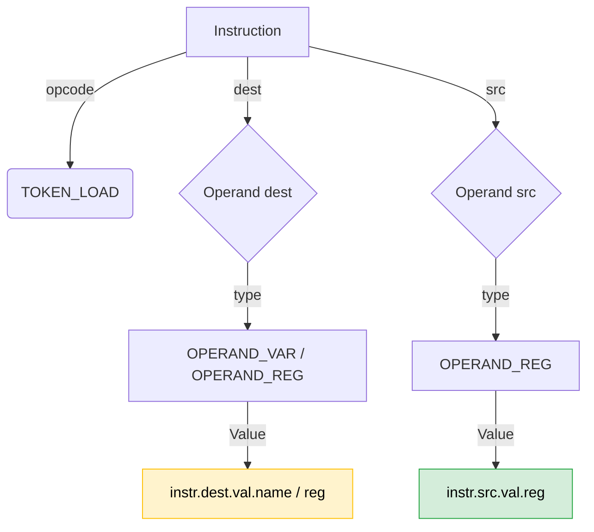
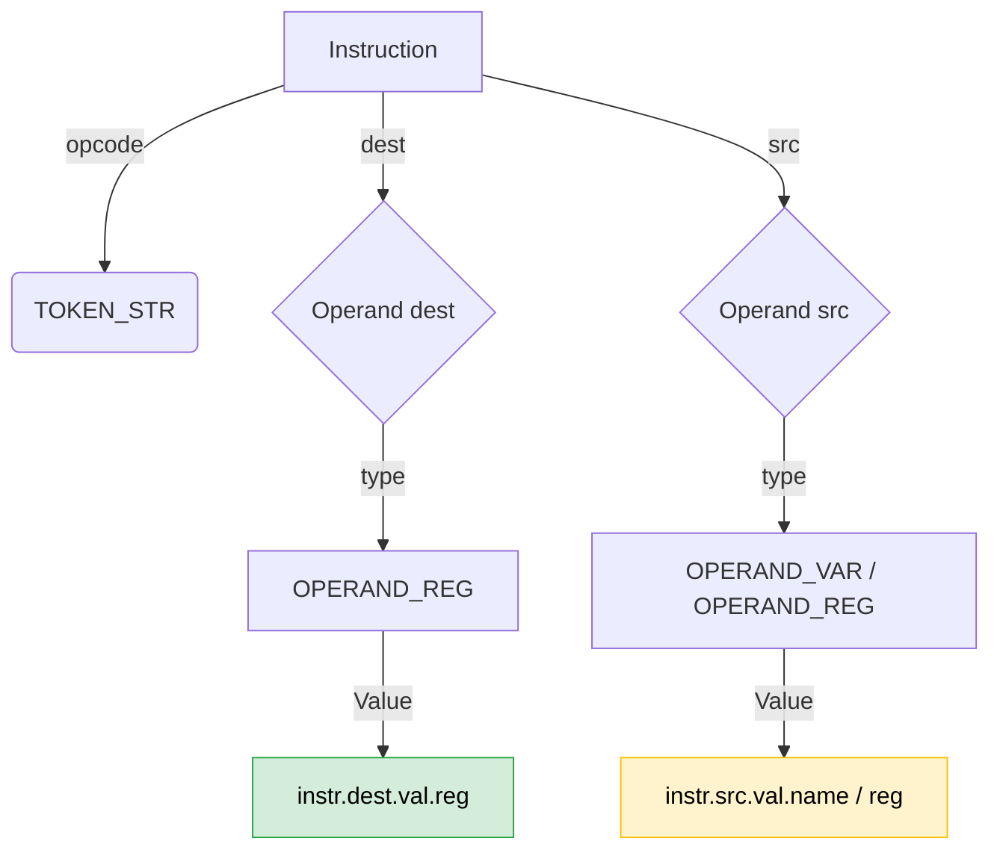
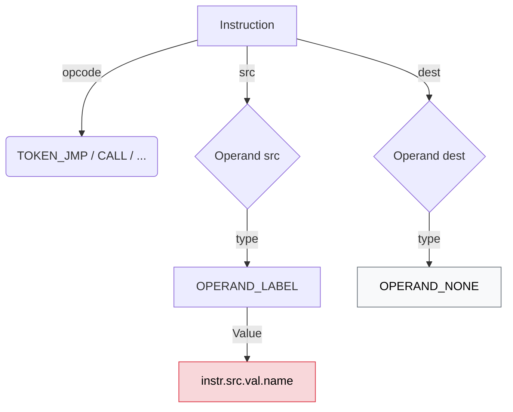
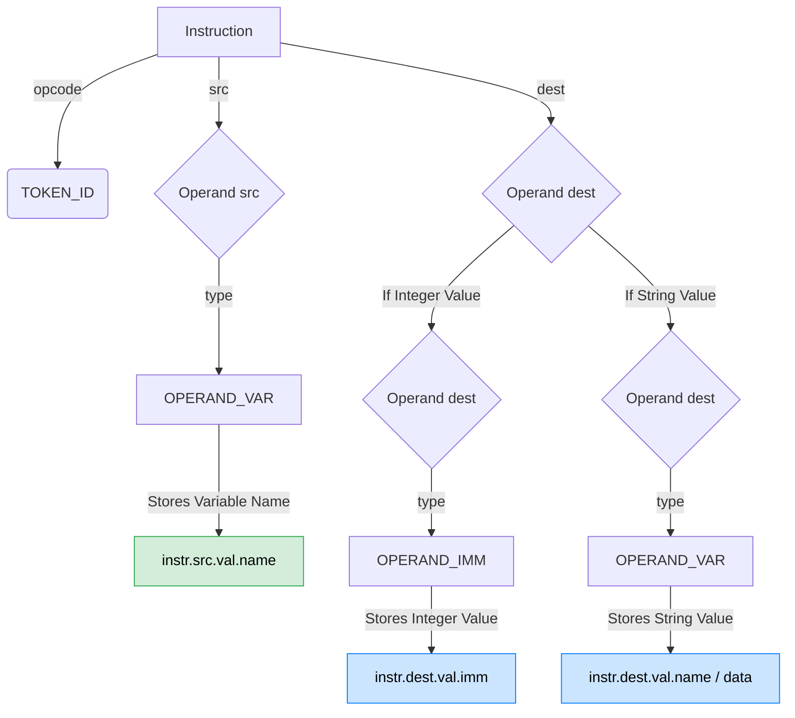
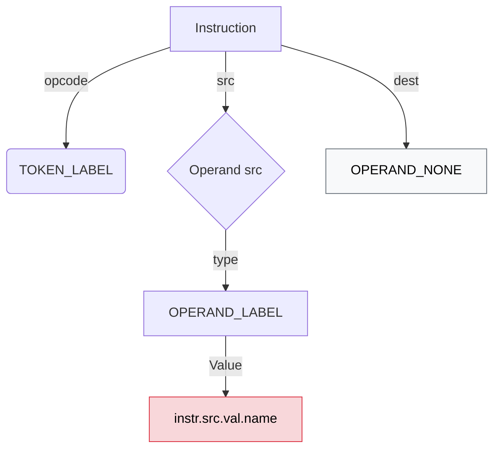

***

# USM Code Generator: Data Mapping Guide

This document provides a detailed breakdown of how the USM Parser stores instruction data inside the `Instruction` struct. It is designed to help contributors write the Code Generator without needing to reverse-engineer the Parser.

## 1. The Core Structs

Before diving into the instructions, here is the memory layout we are working with:

```c
typedef struct {
    tokenType opcode;      // The operation type (e.g., TOKEN_MOV, TOKEN_ADD)
    Operand dest;          // Destination operand
    Operand src;           // Source operand
    int line;              // Line number (used for errors, ignored in Codegen)
} Instruction;

typedef struct {
    OperandType type;      // The type of the operand
    union {
        uint8_t reg;       // Used if type == OPERAND_REG
        int32_t imm;       // Used if type == OPERAND_IMM
        char name[64];     // Used if type == OPERAND_VAR (var names) or OPERAND_LABEL
        char data[64];     // Used if type == OPERAND_VAR (string values, semantic alias for name)
    } val;
} Operand;
```

---

## 2. Instruction Families & Data Mapping

### A. Data Movement (`MOV`)
**Syntax:** `MOV SRC, DEST` *(Note: Source comes first in USM)*

#### Data Mapping
| Data Piece | Struct Location | Type Field | Value Field |
| :--- | :--- | :--- | :--- |
| **Source** | `instr.src` | `OPERAND_REG` or `OPERAND_IMM` | `instr.src.val.reg` or `instr.src.val.imm` |
| **Destination** | `instr.dest` | `OPERAND_REG` | `instr.dest.val.reg` |

#### Visual Flowchart


#### Example in Action: `MOV 50, R1`
*   `instr.opcode` = `TOKEN_MOV`
*   `instr.src.type` = `OPERAND_IMM` ➔ `instr.src.val.imm` = `50`
*   `instr.dest.type` = `OPERAND_REG` ➔ `instr.dest.val.reg` = `1`

---

### B. Arithmetic & Logical (`ADD`, `SUB`, `MUL`, `DIV`, `AND`, `OR`, `XOR`, `CMP`)
**Syntax:** `OP DEST, SRC` *(Destination comes first)*

#### Data Mapping
| Data Piece | Struct Location | Type Field | Value Field |
| :--- | :--- | :--- | :--- |
| **Destination** | `instr.dest` | `OPERAND_REG` | `instr.dest.val.reg` |
| **Source** | `instr.src` | `OPERAND_REG` or `OPERAND_IMM` | `instr.src.val.reg` or `instr.src.val.imm` |

#### Visual Flowchart


#### Example in Action: `ADD R0, 10`
*   `instr.opcode` = `TOKEN_ADD`
*   `instr.dest.type` = `OPERAND_REG` ➔ `instr.dest.val.reg` = `0`
*   `instr.src.type` = `OPERAND_IMM` ➔ `instr.src.val.imm` = `10`

---

### C. Memory Access (`LOAD`, `STR`)

#### 1. `LOAD` (Load from memory to register)
**Syntax:** `LOAD [ADDR], REG`

| Data Piece | Struct Location | Type Field | Value Field |
| :--- | :--- | :--- | :--- |
| **Address (Dest)** | `instr.dest` | `OPERAND_VAR` (for `[myVar]`) or `OPERAND_REG` (for `[R1]`) | `instr.dest.val.name` or `instr.dest.val.reg` |
| **Register (Src)** | `instr.src` | `OPERAND_REG` | `instr.src.val.reg` |



#### 2. `STR` (Store from register to memory)
**Syntax:** `STR REG, [ADDR]`

| Data Piece | Struct Location | Type Field | Value Field |
| :--- | :--- | :--- | :--- |
| **Register (Dest)** | `instr.dest` | `OPERAND_REG` | `instr.dest.val.reg` |
| **Address (Src)** | `instr.src` | `OPERAND_VAR` (for `[myVar]`) or `OPERAND_REG` (for `[R1]`) | `instr.src.val.name` or `instr.src.val.reg` |



---

### D. Control Flow (`JMP`, `JIE`, `JINE`, `JIG`, `JIL`, `CALL`)
**Syntax:** `OP LABEL`

#### Data Mapping
| Data Piece | Struct Location | Type Field | Value Field |
| :--- | :--- | :--- | :--- |
| **Label Name** | `instr.src` | `OPERAND_LABEL` | `instr.src.val.name` |
| **Destination** | `instr.dest` | `OPERAND_NONE` | *(Empty)* |

#### Visual Flowchart


#### Example in Action: `CALL myFunction`
*   `instr.opcode` = `TOKEN_CALL`
*   `instr.src.type` = `OPERAND_LABEL` ➔ `instr.src.val.name` = `"myFunction"`

---

### E. Stack & System (`PUSH`, `POP`, `RET`, `SYSCALL`, `EXIT`)

#### 1. `PUSH`
**Syntax:** `PUSH SRC`
*   `instr.src`: `OPERAND_REG` or `OPERAND_IMM`
*   `instr.dest`: `OPERAND_NONE`

#### 2. `POP`
**Syntax:** `POP DEST`
*   `instr.dest`: `OPERAND_REG`
*   `instr.src`: `OPERAND_NONE`

#### 3. `RET`, `SYSCALL`, `EXIT`
**Syntax:** `OP` (No operands)
*   `instr.src`: `OPERAND_NONE`
*   `instr.dest`: `OPERAND_NONE`

---

### F. Declarations & Labels (The `.data` and `.text` sections)

This section is crucial for generating the assembly header and data sections.

#### 1. Variable Declaration (`TOKEN_ID`)
**Syntax:** `varName value` (e.g., `myVar 100` or `greeting "Hello"`)

#### Data Mapping
| Data Piece | Struct Location | Type Field | Value Field |
| :--- | :--- | :--- | :--- |
| **Variable Name** | `instr.src` | `OPERAND_VAR` | `instr.src.val.name` |
| **Integer Value** | `instr.dest` | `OPERAND_IMM` | `instr.dest.val.imm` |
| **String Value** | `instr.dest` | `OPERAND_VAR` | `instr.dest.val.name` *(or `val.data` for semantic clarity)* |

#### Visual Flowchart


#### Example in Action:
**Code:** `myVar 100`
*   `instr.opcode` = `TOKEN_ID`
*   `instr.src.type` = `OPERAND_VAR` ➔ `instr.src.val.name` = `"myVar"`
*   `instr.dest.type` = `OPERAND_IMM` ➔ `instr.dest.val.imm` = `100`

**Code:** `greeting "Hello USM"`
*   `instr.opcode` = `TOKEN_ID`
*   `instr.src.type` = `OPERAND_VAR` ➔ `instr.src.val.name` = `"greeting"`
*   `instr.dest.type` = `OPERAND_VAR` ➔ `instr.dest.val.name` = `"Hello USM"`

#### 2. Label Declaration (`TOKEN_LABEL`)
**Syntax:** `labelName:`

#### Data Mapping
| Data Piece | Struct Location | Type Field | Value Field |
| :--- | :--- | :--- | :--- |
| **Label Name** | `instr.src` | `OPERAND_LABEL` | `instr.src.val.name` |
| **Destination** | `instr.dest` | `OPERAND_NONE` | *(Empty)* |



***